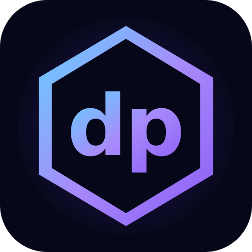
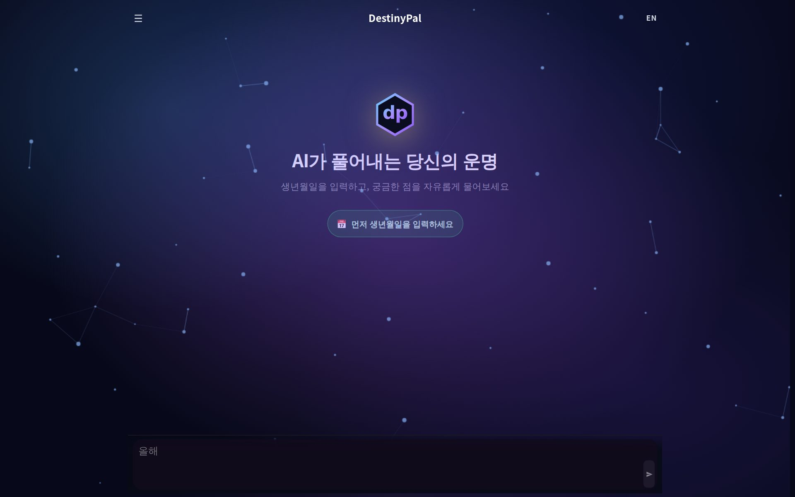
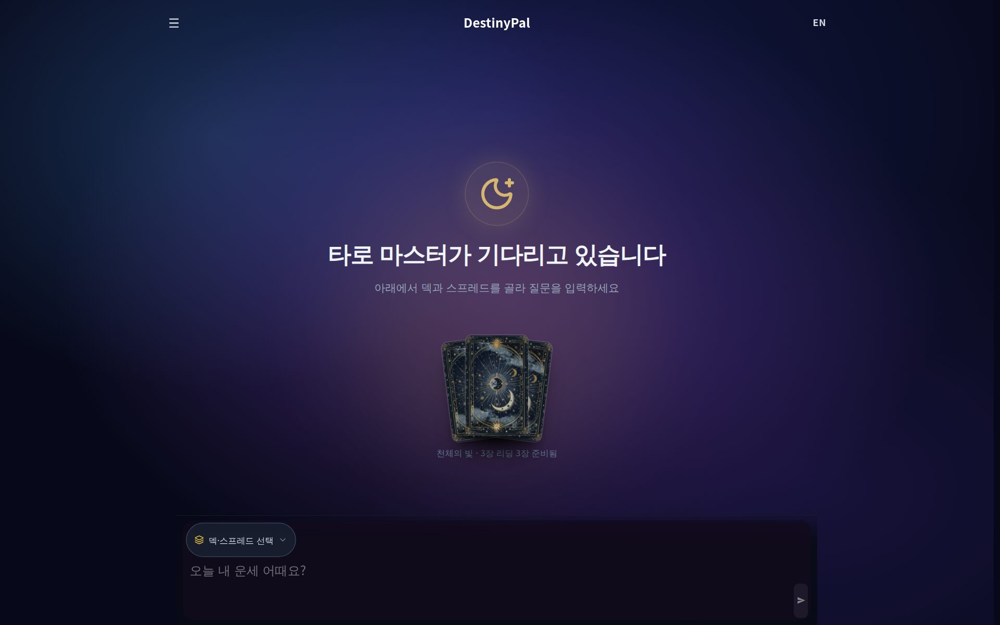
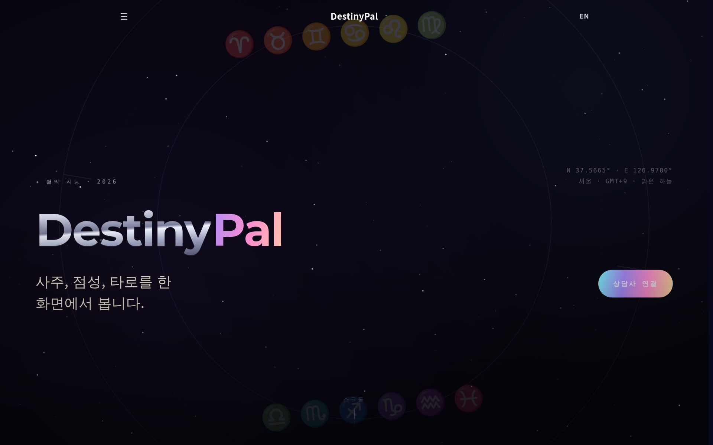
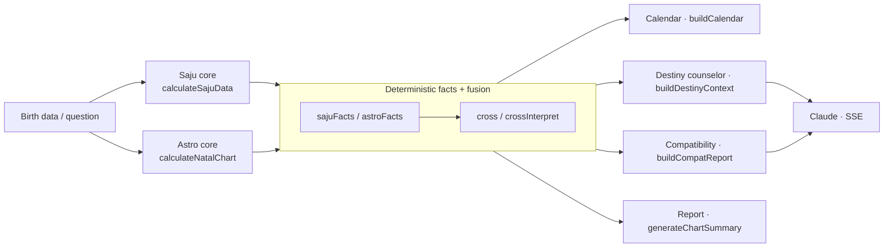

<div align="center">



# DestinyPal

**Saju · Astrology · Tarot · AI counseling — built on a deterministic destiny engine, not a prompt wrapper.**

[](https://github.com/pppaal/saju-astro-chat/actions/workflows/ci.yml)
[](https://github.com/pppaal/saju-astro-chat/actions/workflows/pr-checks.yml)
[](https://github.com/pppaal/saju-astro-chat/actions/workflows/security.yml)
[](LICENSE)


[**Live demo → destinypal.com**](https://destinypal.com) &nbsp;·&nbsp; [Documentation](docs/README.md) &nbsp;·&nbsp; [Architecture](docs/DESTINY_MATRIX.md)

</div>

---

## Why DestinyPal

Most "AI fortune" apps are a thin wrapper around a single prompt: they paste a birth date into an LLM and hope. DestinyPal is the opposite. The **judgment** — which signals matter, how Saju and astrology reinforce or contradict each other, what the timing is — is computed by a **deterministic engine** in code. The LLM only puts that judgment into warm, readable language.

That split is the whole point:

- **Reproducible.** The same input yields the same verdict — it's code, not vibes.
- **One source of truth, many surfaces.** The same deterministic Saju + astrology facts power the calendar, the counselors, and the reports, so they never disagree with each other.
- **Honest money model.** Credits are charged once per result, failed AI streams refund automatically, and pack sizes have a single source of truth.

## Screenshots

<p align="center">
  
  
  
</p>

## Features

- **Saju (사주)** — Korean four‑pillars chart, ten gods, luck pillars, and current timing.
- **Western astrology** — natal chart, transits, returns, and advanced techniques.
- **Tarot** — multiple spreads with streamed, personalized interpretations.
- **AI counselors** — a unified **Destiny (운명)** counselor and a **Compatibility (궁합)** counselor that fuse Saju + astrology into one conversation.
- **Fortune calendar** — day‑level "good / neutral / careful" guidance from the same engine.

## Tech stack

| Layer              | Choice                                                       |
| ------------------ | ------------------------------------------------------------ |
| Framework          | Next.js 16 (App Router) · React 19 · TypeScript              |
| AI                 | Claude (Anthropic Messages API over HTTP), streamed over SSE |
| Auth               | Auth.js v5 (NextAuth) — Google OAuth only (JWT sessions)     |
| Payments           | Stripe one‑time **credit packs** (no subscriptions)          |
| Data               | Prisma 7 (24 models)                                         |
| Cache / rate limit | Upstash Redis + in‑memory fallback                           |
| Tests              | Vitest (~11,700 test cases) · Playwright E2E · k6 load tests |

## Architecture

There is no single "god" engine. Two deterministic calculation cores (Saju and
Western astrology) produce structured **facts**; a cross layer fuses them; and
thin per-surface presenters render those facts for the calendar, counselors, and
reports. Only the conversational surfaces call Claude — and only to turn
already-decided facts into prose.



| Layer                     | Entry point                                                                                            |
| ------------------------- | ------------------------------------------------------------------------------------------------------ |
| Saju core                 | `src/lib/saju/saju.ts` — `calculateSajuData()`                                                         |
| Western astrology core    | `src/lib/astrology/foundation/astrologyService.ts` — `calculateNatalChart()`                           |
| Deterministic facts       | `src/lib/destiny/sajuFacts.ts`, `src/lib/destiny/astroFacts.ts`                                        |
| Saju ↔ astrology fusion   | `src/lib/cross/crossInterpret.ts`                                                                      |
| Calendar engine           | `src/lib/calendar-engine/index.ts` — `buildCalendar()` over `buildNatalContext()`                      |
| Destiny counselor context | `src/lib/destiny/counselorContext.ts` — `buildDestinyContext()` (cached by `counselorContextCache.ts`) |
| Compatibility             | `src/lib/compatibility/compatReport.ts` — `buildCompatReport()`                                        |
| Report summary            | `src/lib/report/local-report-generator.ts` — `generateChartSummary()`                                  |
| Claude streaming          | `src/lib/llm/claude.ts` + `src/lib/llm/claudeSSE.ts` — `streamClaudeAsSSE()`                           |

The cores decide the judgment deterministically; calendar, counselor,
compatibility, and report layers are presentation only. The calendar is rendered
server-side (`src/app/calendar/page.tsx`); the counselor, compatibility, and
tarot surfaces stream Claude output over SSE.

## Quick start

```bash
npm ci                       # install
cp .env.example .env.local   # configure environment
npm run db:migrate           # apply Prisma migrations
npm run dev                  # start the app at http://localhost:3000
```

### Required environment variables

Minimum for local development:

```
DATABASE_URL
NEXTAUTH_SECRET
NEXTAUTH_URL
NEXT_PUBLIC_BASE_URL
TOKEN_ENCRYPTION_KEY
PUBLIC_API_TOKEN
ADMIN_API_TOKEN
CRON_SECRET
ANTHROPIC_API_KEY
```

Production additionally needs Stripe (`STRIPE_SECRET_KEY`, `STRIPE_WEBHOOK_SECRET`, credit‑pack price IDs), Upstash Redis (`UPSTASH_REDIS_REST_URL`, `UPSTASH_REDIS_REST_TOKEN`), and Google OAuth credentials. Optional: `RATE_LIMIT_FAIL_CLOSED=true` denies requests (instead of using the per‑instance in‑memory fallback) when Redis is down — recommended for multi‑instance/serverless. See `.env.example` for the full list.

## Auth & credits

- **Sign‑in:** Google OAuth only — there is no password/credentials login.
- **Credits:** one‑time packs via Stripe Checkout — `mini` (10) · `standard` (40) · `plus` (100) · `mega` (240) · `ultimate` (500). Defined once in `src/lib/config/pricing.ts` (also used by the Stripe webhook).
- **Paid surfaces:**
  - **Tarot** — `POST /api/tarot/interpret-stream` (spreads of 5+ cards cost 2 credits, smaller spreads 1)
  - **Destiny counselor** — `POST /api/counselor/realtime`, billed **per message** (1 credit per turn)
  - **Compatibility counselor** — `POST /api/compatibility/counselor`
- **Refunds:** a counselor stream that fails or returns empty auto‑refunds the charged credit.

## Repository snapshot

Measured with `npm run docs:stats` on 2026-06-15:

| Metric          | Count |
| --------------- | ----: |
| API routes      |    76 |
| App pages       |    41 |
| Component files |   128 |
| Prisma models   |    24 |
| Test files      |   548 |
| Markdown docs   |   161 |

API route audit (`npm run audit:api`, 2026-06-15): **69 / 76** use middleware guards (90.8%), **68** are rate‑limited (89.5%), **57** have validation signals (75.0%). Full per‑route table: [`docs/API_AUDIT_REPORT.md`](docs/API_AUDIT_REPORT.md).

## Quality engineering

The deterministic-engine claim is enforced, not aspirational:

- **~11,700+ test cases** across 540+ files run on every PR — including **determinism goldens** that lock the Saju/astrology verdicts (same birth data ⇒ byte-identical judgment).
- **27 CI checks per PR**: unit + integration + Playwright E2E (desktop/mobile), coverage gates with per-domain floors (auth/credits/payments/security), OWASP ZAP baseline, SAST, secret scan, dependency audit, Lighthouse accessibility, k6 performance smoke.
- **Money paths are locked**: Stripe webhook idempotency & replay-attack tests, refund eligibility matrix, stream-failure auto-refund, race-condition suites for credit consumption.
- **Docs drift gate**: generated reference docs (routes, costs, calculation standards) fail CI when they diverge from code.

```bash
npm run typecheck   # tsc --noEmit (strict)
npm run lint        # eslint
npm test            # vitest run (~2.5 min for the full suite)
```

## Documentation

- [`docs/README.md`](docs/README.md) — documentation hub
- [`docs/DESTINY_MATRIX.md`](docs/DESTINY_MATRIX.md) — destiny engine architecture
- [`docs/CALCULATION_SPEC.md`](docs/CALCULATION_SPEC.md) — calculation spec
- [`docs/TAROT_OVERVIEW.md`](docs/TAROT_OVERVIEW.md) — tarot routes, prompts, and assets
- [`docs/API_AUDIT_REPORT.md`](docs/API_AUDIT_REPORT.md) — generated per‑route audit

## License

[MIT](LICENSE) © 2026 DestinyPal
