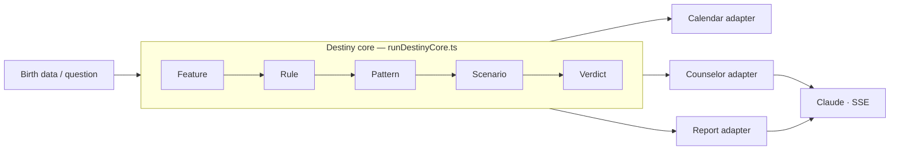

<div align="center">


# DestinyPal

**Saju · Astrology · Tarot · AI counseling — built on a deterministic destiny engine, not a prompt wrapper.**

[](https://github.com/pppaal/saju-astro-chat/actions/workflows/ci.yml)
[](https://github.com/pppaal/saju-astro-chat/actions/workflows/pr-checks.yml)
[](https://github.com/pppaal/saju-astro-chat/actions/workflows/security.yml)
[](LICENSE)


[Live demo](#) &nbsp;·&nbsp; [Documentation](docs/README.md) &nbsp;·&nbsp; [Architecture](docs/DESTINY_MATRIX.md)
<!-- TODO: replace the Live demo "#" above with your deployed URL -->

</div>

---

## Why DestinyPal

Most "AI fortune" apps are a thin wrapper around a single prompt: they paste a birth date into an LLM and hope. DestinyPal is the opposite. The **judgment** — which signals matter, how Saju and astrology reinforce or contradict each other, what the timing is — is computed by a **deterministic engine** in code. The LLM only puts that judgment into warm, readable language.

That split is the whole point:

- **Reproducible.** The same input yields the same verdict — it's code, not vibes.
- **One core, many surfaces.** A single destiny core powers the calendar, the counselors, and the reports, so they never disagree with each other.
- **Honest money model.** Credits are charged once per result, failed AI streams refund automatically, and pack sizes have a single source of truth.

## Screenshots

<!--
Add product screenshots to docs/assets/ and reference them here, e.g.:
<p align="center">
  
  
  
</p>
-->

> _Screenshots coming soon — drop images into `docs/assets/` and uncomment the block above._

## Features

- **Saju (사주)** — Korean four‑pillars chart, ten gods, luck pillars, and current timing.
- **Western astrology** — natal chart, transits, returns, and advanced techniques.
- **Tarot** — multiple spreads with streamed, personalized interpretations.
- **AI counselors** — a unified **Destiny (운명)** counselor and a **Compatibility (궁합)** counselor that fuse Saju + astrology into one conversation.
- **Fortune calendar** — day‑level "good / neutral / careful" guidance from the same engine.

## Tech stack

| Layer | Choice |
|------|--------|
| Framework | Next.js 16 (App Router) · React 19 · TypeScript |
| AI | Claude via `@anthropic-ai/sdk`, streamed over SSE |
| Auth | NextAuth — Google OAuth only (JWT sessions) |
| Payments | Stripe one‑time **credit packs** (no subscriptions) |
| Data | Prisma (42 models) |
| Cache / rate limit | Upstash Redis + in‑memory fallback |
| Tests | Vitest |

## Architecture

The deterministic core produces a verdict; thin adapters render it per surface.



- Core judgment entry: `src/lib/destiny-matrix/core/runDestinyCore.ts`
- Presentation adapters live under `src/lib/destiny-matrix/core/`
- The core decides timing/judgment; calendar, counselor, and report layers are **presentation only**.

## Quick start

```bash
npm ci                       # install
cp .env.example .env.local   # configure environment
npm run db:migrate           # apply Prisma migrations
npm run dev                  # start the app at http://localhost:3000
```

### Required environment variables

Minimum for local development:

```
DATABASE_URL
NEXTAUTH_SECRET
NEXTAUTH_URL
NEXT_PUBLIC_BASE_URL
TOKEN_ENCRYPTION_KEY
PUBLIC_API_TOKEN
ADMIN_API_TOKEN
CRON_SECRET
ANTHROPIC_API_KEY
```

Production additionally needs Stripe (`STRIPE_SECRET_KEY`, `STRIPE_WEBHOOK_SECRET`, credit‑pack price IDs), Upstash Redis (`UPSTASH_REDIS_REST_URL`, `UPSTASH_REDIS_REST_TOKEN`), and Google OAuth credentials. Optional: `RATE_LIMIT_FAIL_CLOSED=true` denies requests (instead of using the per‑instance in‑memory fallback) when Redis is down — recommended for multi‑instance/serverless. See `.env.example` for the full list.

## Auth & credits

- **Sign‑in:** Google OAuth only — there is no password/credentials login.
- **Credits:** one‑time packs via Stripe Checkout — `mini` (5) · `standard` (15) · `plus` (40) · `mega` (100) · `ultimate` (250). Defined once in `src/lib/config/pricing.ts` (also used by the Stripe webhook).
- **Paid surfaces:**
  - **Tarot** — `POST /api/tarot/interpret-stream` (large spreads of 8+ cards cost 2 credits)
  - **Destiny counselor** — `POST /api/counselor/realtime`, billed **per session** (1 credit opens a session; turns within the window are free)
  - **Compatibility counselor** — `POST /api/compatibility/counselor`
- **Refunds:** a counselor stream that fails or returns empty auto‑refunds the charged credit.

## Repository snapshot

Measured with `npm run docs:stats` on 2026-05-21:

| Metric | Count |
|--------|------:|
| API routes | 81 |
| App pages | 51 |
| Component files | 112 |
| Prisma models | 42 |
| Test files | 648 |
| Markdown docs | 144 |

API route audit (`npm run audit:api`, 2026-05-21): **78 / 81** use middleware guards (96.3%), **73** are rate‑limited (90.1%), **60** have validation signals (74.1%).

## Quality checks

```bash
npm run typecheck   # tsc --noEmit
npm run lint        # eslint
npm test            # vitest run
```

CI runs on every PR via GitHub Actions (`ci.yml`, `pr-checks.yml`, `security.yml`).

## Documentation

- [`docs/README.md`](docs/README.md) — documentation hub
- [`docs/DESTINY_MATRIX.md`](docs/DESTINY_MATRIX.md) — destiny engine architecture
- [`docs/CALCULATION_SPEC.md`](docs/CALCULATION_SPEC.md) — calculation spec
- [`docs/TAROT_OVERVIEW.md`](docs/TAROT_OVERVIEW.md) — tarot routes, prompts, and assets
- [`docs/API_AUDIT_REPORT.md`](docs/API_AUDIT_REPORT.md) — generated per‑route audit

## License

[MIT](LICENSE) © 2026 DestinyPal
