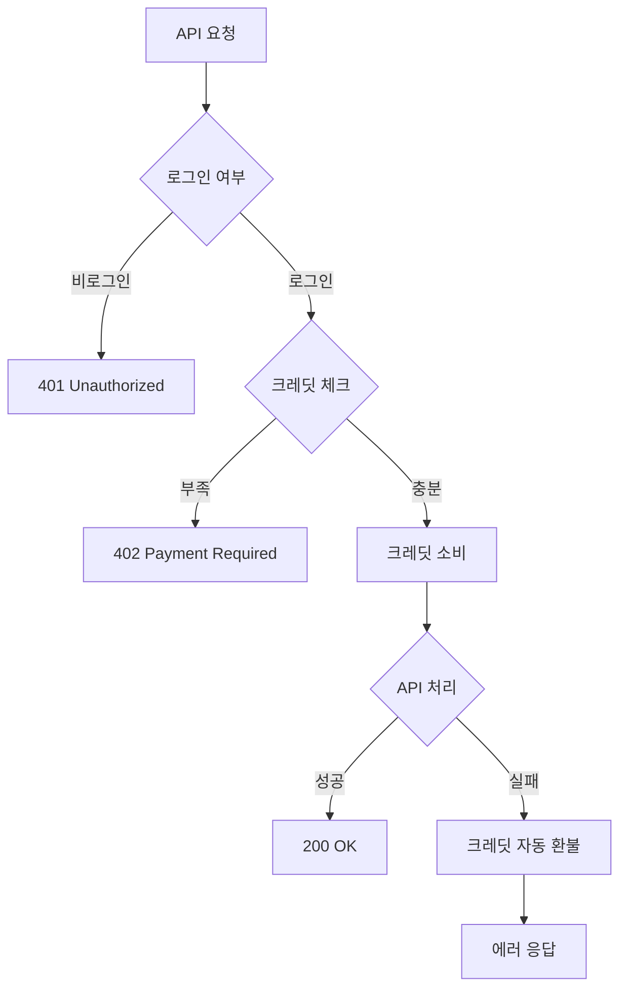

# API 응답 정책 문서

## 목차
1. [무료/프리미엄 티어 정책](#무료프리미엄-티어-정책)
2. [크레딧 시스템 정책](#크레딧-시스템-정책)
3. [에러 응답 규칙](#에러-응답-규칙)
4. [응답 스키마 검증](#응답-스키마-검증)
5. [Rate Limiting 정책](#rate-limiting-정책)

---

## 무료/프리미엄 티어 정책

### 티어 구조

```typescript
type PremiumTier = "free" | "basic" | "premium" | "enterprise"
```

### 티어별 제공 내용

| 티어 | 월간 리딩 크레딧 | 궁합 분석 | 후속 질문 | 특별 기능 |
|------|------------------|-----------|-----------|-----------|
| **Free** | 3회 | 1회 | 0회 | - |
| **Basic** | 30회 | 10회 | 10회 | 우선 지원 |
| **Premium** | 100회 | 무제한 | 50회 | 모든 기능 |
| **Enterprise** | 무제한 | 무제한 | 무제한 | 전담 지원 |

### 크레딧 소비 규칙

1. **Reading Credits** (`"reading"`)
   - 소비 대상: Dream, Tarot, Destiny Map, Saju, Astrology, I-Ching
   - 소비량: 각 리딩당 1 크레딧
   - 무료 사용자: 월 3회 제한
   - 프리미엄: 티어별 제한 적용

2. **Compatibility Credits** (`"compatibility"`)
   - 소비 대상: 궁합 분석, 성격 호환성 분석
   - 소비량: 각 분석당 1 크레딧
   - 무료 사용자: 월 1회 제한
   - 프리미엄: 티어별 제한 적용

3. **Follow-up Credits** (`"followUp"`)
   - 소비 대상: 기존 리딩에 대한 추가 질문
   - 소비량: 각 질문당 1 크레딧
   - 무료 사용자: 불가
   - 프리미엄: 티어별 제한 적용

### 크레딧 초기화

- **초기화 주기**: 매월 1일 00:00 UTC
- **자동 초기화**: Cron job (`/api/cron/reset-credits`)
- **초기화 시점**: 모든 사용자 동시 초기화

---

## 크레딧 시스템 정책

### 크레딧 체크 플로우



### 크레딧 소비 시점

1. **사전 소비 (Pre-consumption)**
   - API 요청 접수 시점에 즉시 소비
   - Middleware에서 자동 처리
   - 실패 시 자동 환불 보장

2. **환불 정책**
   - **자동 환불 조건**:
     - API 처리 실패 (5xx 에러)
     - 타임아웃 발생
     - Backend 서비스 장애
     - 데이터베이스 오류
   - **환불 불가 조건**:
     - 사용자 입력 오류 (4xx 에러)
     - Rate limit 초과
     - Validation 실패

3. **환불 처리**
   ```typescript
   // Middleware에서 자동 제공
   context.refundCreditsOnError?.(errorMessage, metadata);
   ```

### 크레딧 에러 응답

#### 402 Payment Required (크레딧 부족)

```json
{
  "error": "이번 달 리딩 횟수를 모두 사용했습니다. 플랜을 업그레이드하세요.",
  "code": "no_credits",
  "remaining": 0,
  "upgradeUrl": "/pricing"
}
```

**에러 코드**:
- `no_credits`: 리딩 크레딧 부족
- `compatibility_limit`: 궁합 분석 크레딧 부족
- `followup_limit`: 후속 질문 크레딧 부족
- `not_authenticated`: 로그인 필요 → 401 반환

---

## 에러 응답 규칙

### 표준 에러 응답 구조

모든 에러 응답은 **반드시** 다음 구조를 따라야 합니다:

```typescript
{
  success: false,
  error: {
    code: string,      // 에러 코드 (대문자 스네이크 케이스)
    message: string,   // 사용자에게 표시할 메시지 (다국어 지원)
    status: number,    // HTTP 상태 코드
    details?: unknown  // 개발 환경에서만 포함
  }
}
```

### HTTP 상태 코드 매핑

| 상태 코드 | 에러 코드 | 설명 | 응답 예시 |
|-----------|-----------|------|-----------|
| **400** | `BAD_REQUEST` | 잘못된 요청 | 필수 파라미터 누락, 잘못된 형식 |
| **401** | `UNAUTHORIZED` | 인증 필요 | 로그인하지 않은 사용자 |
| **402** | (커스텀) | 결제 필요 | 크레딧 부족 |
| **403** | `FORBIDDEN` | 권한 없음 | 접근 권한이 없는 리소스 |
| **404** | `NOT_FOUND` | 리소스 없음 | 존재하지 않는 데이터 |
| **413** | `PAYLOAD_TOO_LARGE` | 요청 크기 초과 | Body 크기 제한 초과 |
| **422** | `VALIDATION_ERROR` | 검증 실패 | Zod 스키마 검증 실패 |
| **429** | `RATE_LIMITED` | 요청 제한 초과 | Rate limit 초과 |
| **500** | `INTERNAL_ERROR` | 서버 내부 오류 | 예상치 못한 에러 |
| **502** | `BACKEND_ERROR` | 백엔드 서비스 오류 | AI 서비스 장애 |
| **503** | `SERVICE_UNAVAILABLE` | 서비스 불가 | 서비스 점검 중 |
| **504** | `TIMEOUT` | 요청 타임아웃 | 처리 시간 초과 |

### 다국어 에러 메시지

모든 에러 메시지는 사용자의 `Accept-Language` 헤더 또는 `locale` 파라미터에 따라 자동 번역됩니다.

지원 언어: `en`, `ko`, `ja`, `zh`

**예시**:
```typescript
// 한국어 사용자
{
  "error": {
    "code": "UNAUTHORIZED",
    "message": "계속하려면 로그인해주세요.",
    "status": 401
  }
}

// 영어 사용자
{
  "error": {
    "code": "UNAUTHORIZED",
    "message": "Please log in to continue.",
    "status": 401
  }
}
```

### Validation 에러 상세 정보

**422 Unprocessable Entity** 응답 시 `details` 필드 포함:

```json
{
  "success": false,
  "error": {
    "code": "VALIDATION_ERROR",
    "message": "입력 검증에 실패했습니다.",
    "status": 422,
    "details": {
      "field": "birthDate",
      "issue": "Invalid date format",
      "expected": "YYYY-MM-DD",
      "received": "2023/01/01"
    }
  }
}
```

---

## 응답 스키마 검증

### Zod 스키마 사용 규칙

1. **모든 API 응답은 Zod 스키마로 정의되어야 합니다**
   - 위치: `src/lib/api/response-schemas.ts`
   - 변경 시 컴파일 타임에 즉시 검출

2. **응답 생성 시 스키마 검증 필수**
   ```typescript
   import { ResponseSchemas } from '@/lib/api/response-schemas';

   // ✅ 올바른 사용
   const response = createValidatedSuccessResponse(
     DreamAnalysisSchema,
     data
   );

   // ❌ 잘못된 사용 (검증 없이 반환)
   return NextResponse.json({ data });
   ```

3. **타입 가드 활용**
   ```typescript
   if (isSuccessResponse(response)) {
     // response.data 사용 가능
   }

   if (isCreditError(response)) {
     // 크레딧 부족 처리
   }
   ```

### 필수 검증 항목

#### 성공 응답
```typescript
{
  success: true,              // ✅ 필수
  data: T,                    // ✅ 필수, 스키마 정의된 타입
  meta?: {                    // ⚠️ 선택
    timestamp?: string,
    requestId?: string
  }
}
```

#### 에러 응답
```typescript
{
  success: false,             // ✅ 필수
  error: {
    code: string,             // ✅ 필수
    message: string,          // ✅ 필수
    status: number,           // ✅ 필수 (400-599)
    details?: unknown         // ⚠️ 개발 환경에서만
  }
}
```

---

## Rate Limiting 정책

### Rate Limit 기준

| API 유형 | 제한 (요청/시간) | 윈도우 | 키 기준 |
|----------|------------------|--------|---------|
| **Public Stream** | 30req/60s | 60초 | IP |
| **Authenticated** | 60req/60s | 60초 | IP |
| **Premium Check** | 5req/60s | 60초 | Email |
| **Admin** | 100req/60s | 60초 | UserId |

### Rate Limit 에러 응답

**429 Too Many Requests**:

```json
{
  "success": false,
  "error": {
    "code": "RATE_LIMITED",
    "message": "요청이 너무 많습니다. 잠시 후 다시 시도해주세요.",
    "status": 429
  }
}
```

**필수 헤더**:
```http
Retry-After: 60
X-RateLimit-Limit: 30
X-RateLimit-Remaining: 0
```

### Rate Limit 우회

- **개발 환경**: `BYPASS_RATE_LIMIT=true` 환경 변수 설정 가능
- **프로덕션**: 절대 우회 불가
- **보안**: 프로덕션에서 우회 시도 시 로그 기록 및 경고

---

## 스키마 변경 시 체크리스트

API 응답 구조를 변경할 때 **반드시** 다음을 확인하세요:

- [ ] Zod 스키마 업데이트 (`response-schemas.ts`)
- [ ] TypeScript 타입 자동 추론 확인
- [ ] 기존 API 호출 코드 검토
- [ ] 테스트 코드 업데이트
- [ ] 클라이언트 코드 (React 컴포넌트) 업데이트
- [ ] API 문서 업데이트
- [ ] 버전 관리 (Breaking Change인 경우)

---

## 참고 파일

- **스키마 정의**: `src/lib/api/response-schemas.ts`
- **에러 핸들러**: `src/lib/api/errorHandler.ts`
- **미들웨어**: `src/lib/api/middleware.ts`
- **크레딧 시스템**: `src/lib/credits/withCredits.ts`
- **요청 검증**: `src/lib/api/schemas.ts`

---

**마지막 업데이트**: 2026-01-26
**문서 버전**: 1.0.0
